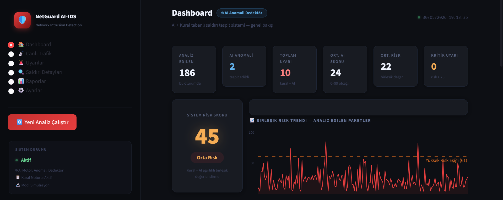
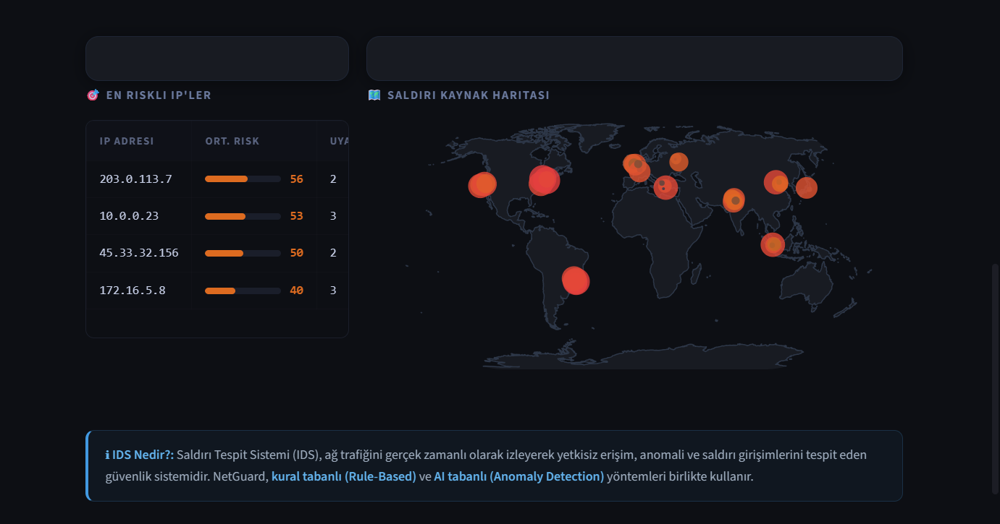
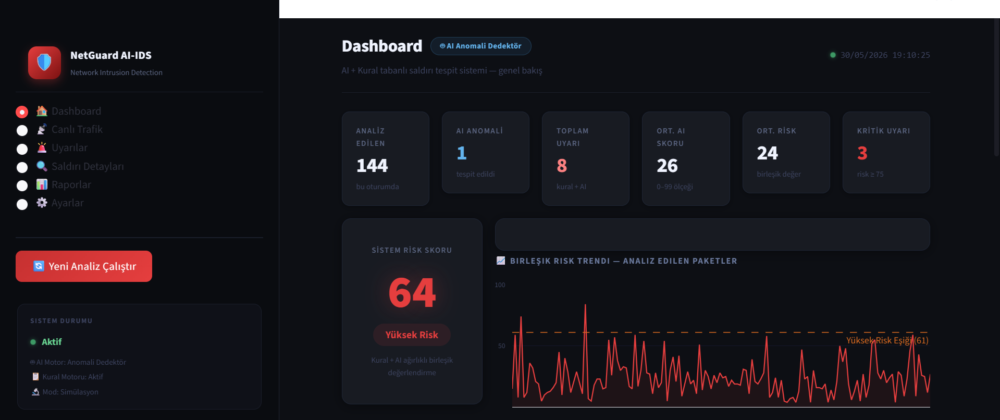
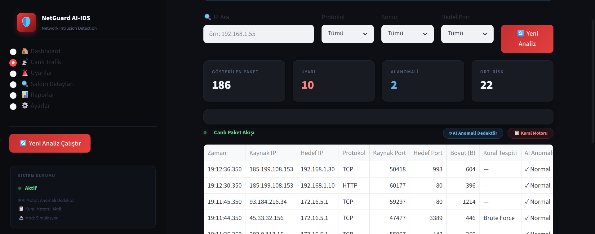
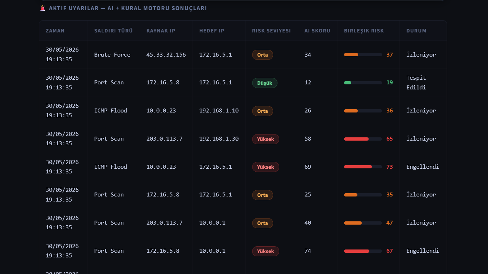
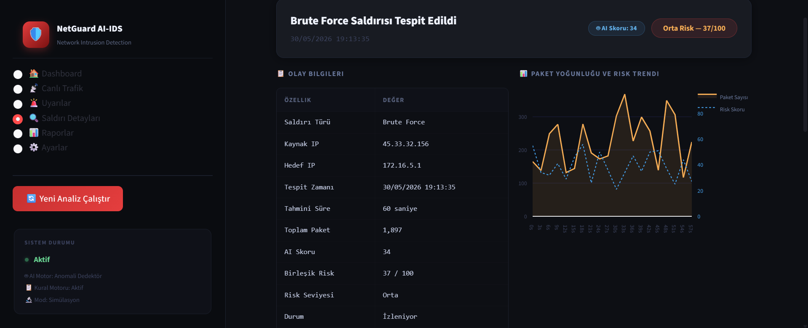
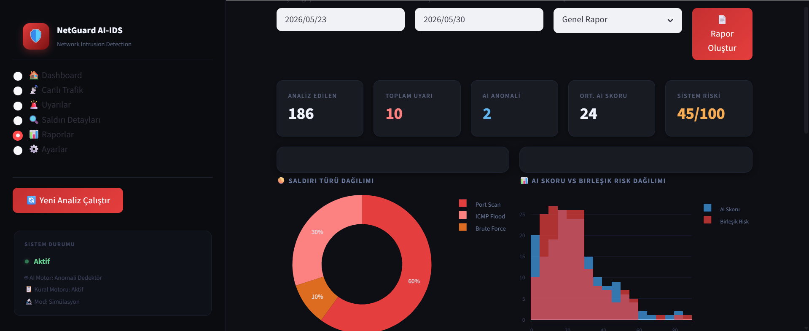
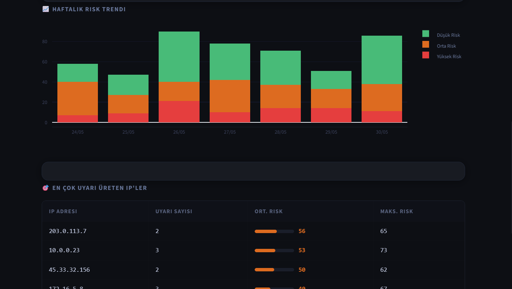
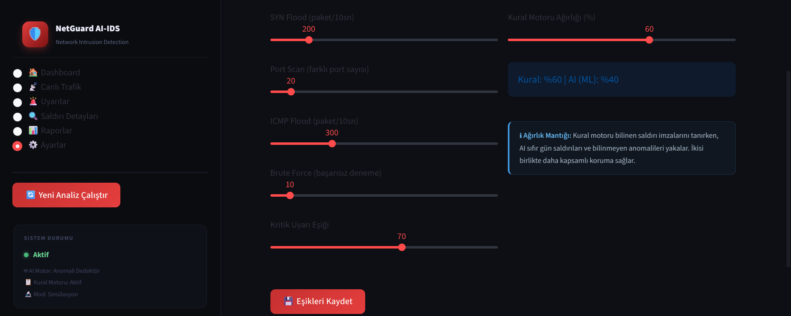
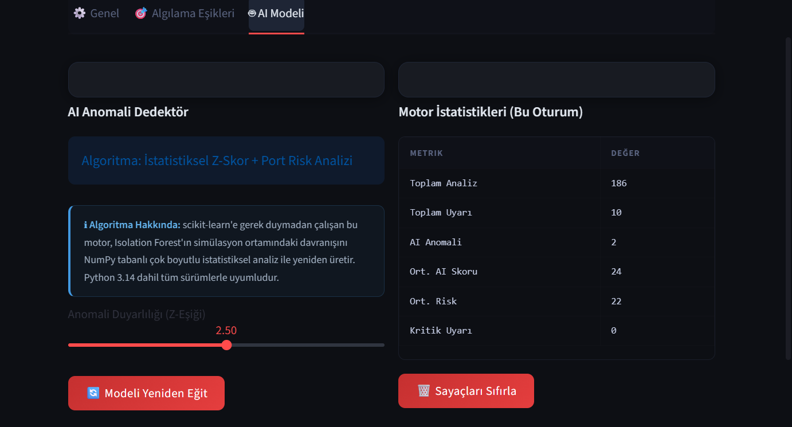

# NetGuard AI-IDS

## Genel Bakış

NetGuard AI-IDS, ağ trafiğini analiz ederek saldırı girişimlerini ve olağandışı davranışları tespit etmek amacıyla geliştirilmiş bir Ağ Saldırı Tespit Sistemi (Intrusion Detection System) simülasyonudur.

Proje kapsamında hem kural tabanlı saldırı tespiti hem de anomali tabanlı analiz yaklaşımı birlikte kullanılmıştır. Amaç, ağ güvenliği alanında kullanılan IDS sistemlerinin temel çalışma mantığını uygulamalı olarak modellemek ve kullanıcıya anlaşılır bir güvenlik izleme paneli sunmaktır.

Bu çalışma, Mersin Üniversitesi Bilişim Sistemleri ve Teknolojileri Bölümü Bilgisayar Ağ Güvenliği dersi kapsamında dönem projesi olarak geliştirilmiştir.

---

## Projenin Amacı

Bu projenin temel amacı:

* Ağ güvenliği kavramlarını uygulamalı olarak göstermek
* IDS sistemlerinin çalışma mantığını modellemek
* Kural tabanlı ve anomali tabanlı tespit yöntemlerini bir arada kullanmak
* Risk skorlama mekanizması geliştirmek
* Modern bir güvenlik izleme arayüzü tasarlamak

---

## Sistem Özellikleri

### Kural Tabanlı Tespit

Sistem aşağıdaki saldırı türlerini tespit edebilmektedir:

* SYN Flood
* Port Scan
* Brute Force
* ICMP Flood

### Anomali Analizi

Kural tabanlı tespitlere ek olarak trafik davranışları analiz edilerek olağandışı durumlar belirlenmektedir.

Değerlendirilen parametreler:

* Kaynak port
* Hedef port
* Paket boyutu
* Protokol türü
* Trafik davranışı

### İzleme ve Analiz

* Gerçek zamanlı trafik görüntüleme
* Risk skorlama sistemi
* Saldırı detay ekranları
* Saldırı kaynak haritası
* İstatistiksel raporlama
* PDF rapor oluşturma

---

## Sistem Mimarisi

```text
Paket
   │
   ▼
Kural Motoru
(SYN Flood, Port Scan,
Brute Force, ICMP Flood)
   │
   ▼
Anomali Analizi
(Z-Score Tabanlı)
   │
   ▼
Risk Skorlama Motoru
   │
   ▼
Dashboard ve Uyarılar
```

---

## Dashboard

Dashboard ekranı sistemin genel durumunu göstermektedir.

* Analiz edilen paket sayısı
* Toplam uyarı sayısı
* AI anomali sayısı
* Ortalama risk değeri
* Kritik uyarılar
* Sistem risk skoru



---

## Saldırı Kaynak Haritası

Tespit edilen saldırı kaynakları dünya haritası üzerinde görselleştirilmektedir.



---

## Yüksek Risk Senaryosu

Sistem yüksek riskli trafik yoğunluğu oluştuğunda risk skorunu artırarak kullanıcıyı uyarmaktadır.



---

## Canlı Trafik İzleme

Analiz edilen paketler gerçek zamanlı olarak görüntülenmektedir.

Her kayıt için:

* Kaynak IP
* Hedef IP
* Protokol
* Port bilgileri
* Paket boyutu
* Kural tespiti
* Anomali sonucu

bilgileri sunulmaktadır.



---

## Uyarılar

Tespit edilen güvenlik olayları merkezi uyarı ekranında listelenmektedir.



---

## Saldırı Detayları

Her saldırı kaydı için detaylı teknik bilgiler ve güvenlik değerlendirmeleri gösterilmektedir.



---

## Raporlama ve Analitik

Sistem saldırı türleri, risk dağılımları ve anomali sonuçları için görsel raporlar üretmektedir.



---

## Risk Trendleri

Risk seviyelerinin zamana bağlı değişimi ve en çok uyarı üreten IP adresleri analiz edilmektedir.



---

## IDS Eşik Ayarları

Sistem yöneticileri saldırı algılama eşiklerini ve risk hesaplama parametrelerini değiştirebilmektedir.



---

## AI Model Ayarları

Anomali tespit motorunun hassasiyeti ve çalışma parametreleri yapılandırılabilmektedir.



---

## Proje Yapısı

```text
netguard_ids/
│
├── app.py
├── analysis_engine.py
├── rule_detector.py
├── ml_detector.py
├── risk_score.py
├── packet_capture.py
├── database.py
├── report_generator.py
├── utils.py
│
├── assets/
├── data/
├── models/
├── reports/
└── screenshots/
```

---

## Kurulum

```bash
git clone https://github.com/furkan21082004/ai-network-intrusion-detection-system.git

cd ai-network-intrusion-detection-system

python -m venv venv

# Windows
venv\Scripts\activate

pip install -r requirements.txt

streamlit run app.py
```

---

## Kullanılan Teknolojiler

* Python
* Streamlit
* Pandas
* NumPy
* Plotly
* SQLite
* ReportLab

---

## Gelecekte Yapılabilecek Çalışmalar

* Gerçek ağ trafiği entegrasyonu
* Wireshark/PyShark desteği
* Otomatik IP engelleme
* Tehdit istihbaratı entegrasyonu
* Derin öğrenme tabanlı anomali tespiti

---

## Geliştirici

**Muhammet Ali Furkan Karamert**

Mersin Üniversitesi
Bilişim Sistemleri ve Teknolojileri

Bilgisayar Ağ Güvenliği Dersi Final Projesi
